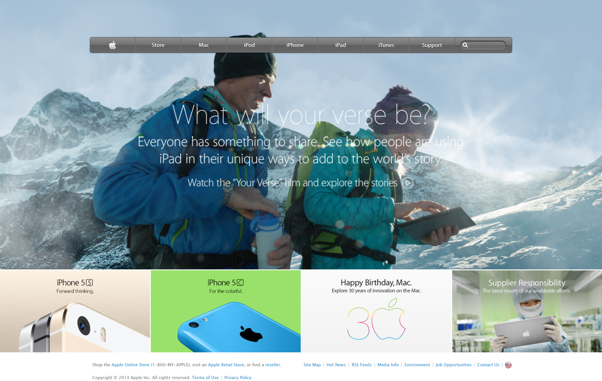

# Building with Responsive design

Use of css and all of the page is responsive.

## Built With

- HTML, Css

## Live Demo

[Live Demo Link](https://raw.githack.com/arslanbisharat/building-with-responsive-design/main-project/index.html)

## Author

👤 **Muhammad Arslan**

- Github: [@githubhandle](https://github.com/arslanbisharat)
- Twitter: [@twitterhandle](https://twitter.com/arslan_bisharat)
- Linkedin: [linkedin](https://www.linkedin.com/in/muhammad-arslan-2020bb156)

## 🤝 Contributing

Contributions, issues and feature requests are welcome!

Feel free to check the [issues page](https://github.com/arslanbisharat/building-with-responsive-design/issues).

## Show your support

Give a ⭐️ if you like this project!

